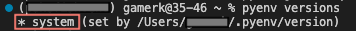
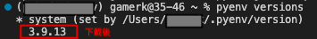

# Virtual Environment 
為了下次換機的時候，不用重新 google 的小筆記
- system : OS
- lang : Python3 
- IDE : VScode

## 安裝 pyenv & virtualenv
### pyenv
> 管理虛擬環境的python
```shell
brew update
brew install pyenv
```
### virtualenv
> 管理虛擬環境
```shell
pip3 install virtualenv
```
### pipenv 
> 管理虛擬環境的資源包(待續...)

```
pip3 install pipenv

```


## 環境設置
1. 建立虛擬環境（資料夾型態）
    ```shell
    cd <你要的資料夾>
    ```
    ```shell
    virtualenv <自命名虛擬環境 資料夾>
    ```

2. 使用虛擬環境
    ```shell
    source <自命名虛擬環境 資料夾>/bin/activate

    ```

3. 退出虛擬環境
    ```shell
    deactivate
    ```

## 版本設置
1. 列出可供下載的版號

    `pyenv install --list`

2. 下載

    `pyenv install 3.x.x`

3. 查看目前 pyenv 擁有的版號
    
    `pyenv persions`
    - 下載前
    
        只有 **＊system**

        

    - 下載後

        

4. 換到所需版後

    `pyenv global 3.x.x`
    
    > **＊ 3.x.x**

    - global : 全域設定
    - local : 區域設定
    - shell : 當前 shell 設定

5. pyenv with VScode 
    1. 打開專案(.py)
    2. 找到 select interpreter 
        - 下方列有系統版號可直接點選
        - command+shift+p 搜尋 **select interpreter**
    3. 選擇所需的版號


## 資源包

1. 查看資源包    
    > 會顯示當前版本有的資源包，若在system就顯示system的
    ```shell
    pip3 list 
    ```
2. 
